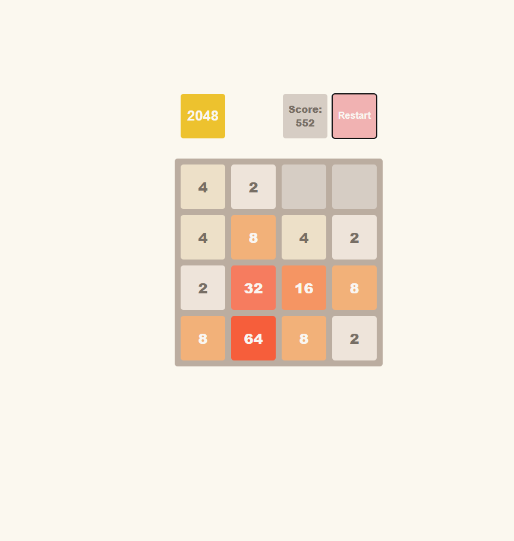

# 2048 Game Clone (Vanilla JS)

## 🔗 Live Demo
### [👉 Click here to play the game](https://kanezoor.github.io/react-2048-game/)

## 📝 Description
A fully functional implementation of the classic "2048" sliding tile puzzle game, built entirely with **Vanilla JavaScript**.

The goal of this project was to strengthen my understanding of **Algorithms**, **Data Structures (Arrays/Grids)**, and complex **DOM Manipulation** without relying on any external frameworks or libraries.

## 🛠 Technologies Used
* **Core Logic:** Vanilla JavaScript (ES6+)
* **Structure:** HTML5
* **Styling:** CSS3 (Animations & Layout)

## ✨ Key Features
* **🎮 Game Logic:** Complete implementation of the sliding and merging algorithm (Up, Down, Left, Right).
* **🔢 Score Tracking:** Dynamic score updates as tiles merge.
* **🏁 Win/Loss States:** detects when the player reaches 2048 (Win) or when no moves are possible (Game Over).
* **⌨️ Keyboard Support:** Smooth gameplay using arrow keys.
* **Responsive Design:** Playable on different screen sizes.

## 🚀 How to Run Locally
1. Clone the repository:
   git clone https://github.com/Kanezoor/react-2048-game.git
2. Install dependencies:
   npm install
3. Start the game:
   npm start

🧠 What I Learned
Array Manipulation: I learned how to treat the game board as a 2D grid (matrix) and wrote algorithms to traverse rows and columns to merge identical numbers.

DOM Updates: I practiced separating the "Game State" (variables in JS) from the "UI" (HTML updates), ensuring the screen always matches the internal data.

Event Listeners: Managed keyboard input events to trigger specific game functions.

Problem Solving: Handling edge cases, such as preventing a tile from merging twice in a single move.

 Created by <a href="https://github.com/Kanezoor">Vladyslav Kostiuk</a> 

